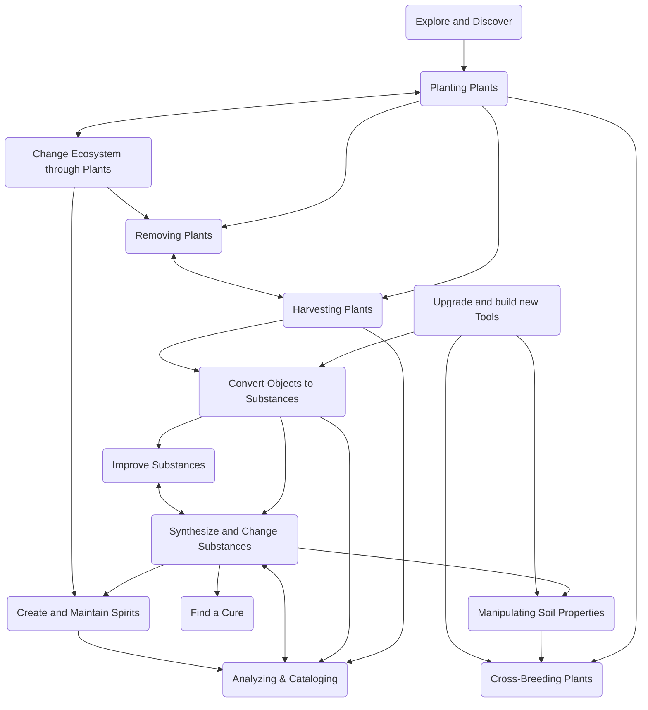

```mermaid
graph TD;
    Plant("Planting Plants")
    Harvest("Harvesting Plants")
    Remove("Removing Plants")
    Fertilize("Manipulating Soil Properties")
    Breeding("Cross-Breeding Plants")
    Analyse("Analyzing & Cataloging")
    
    Influence("Change Ecosystem through Plants")

    Plant --> Harvest
    Plant --> Remove
    Remove <--> Harvest
    Harvest --> Analyse
    Plant --> Breeding
    Fertilize --> Breeding
    Plant <--> Influence
    Influence --> Remove
    
    Extract("Convert Objects to Substances")
    Purify("Improve Substances")
    Synth("Synthesize and Change Substances")
    Advance("Upgrade and build new Tools")

    Extract --> Purify
    Extract --> Synth
    Purify <--> Synth
    Advance --> Extract
    Extract --> Analyse
    Synth <--> Analyse


  Synth --> Fertilize
  Advance --> Fertilize
  Advance --> Breeding
  Harvest --> Extract

    Cure("Find a Cure")
    Creatures("Create and Maintain Spirits")
    Exploration("Explore and Discover");

  Synth --> Creatures
  Synth --> Cure
  Influence --> Creatures
  Exploration --> Plant
  Creatures --> Analyse

```
